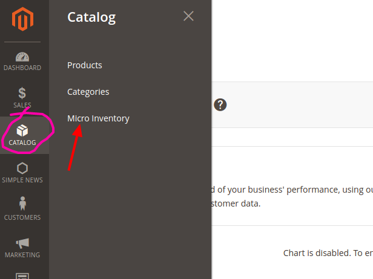
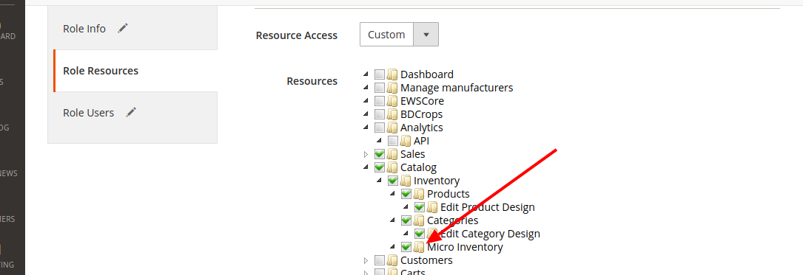
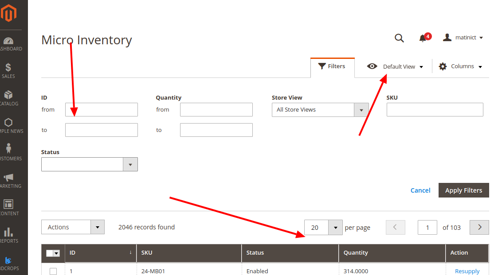
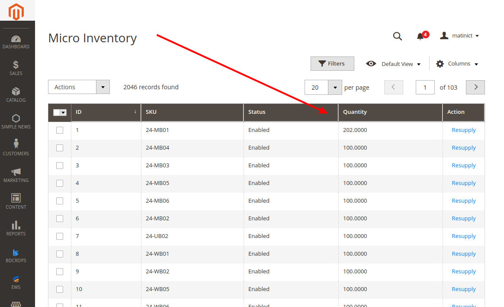
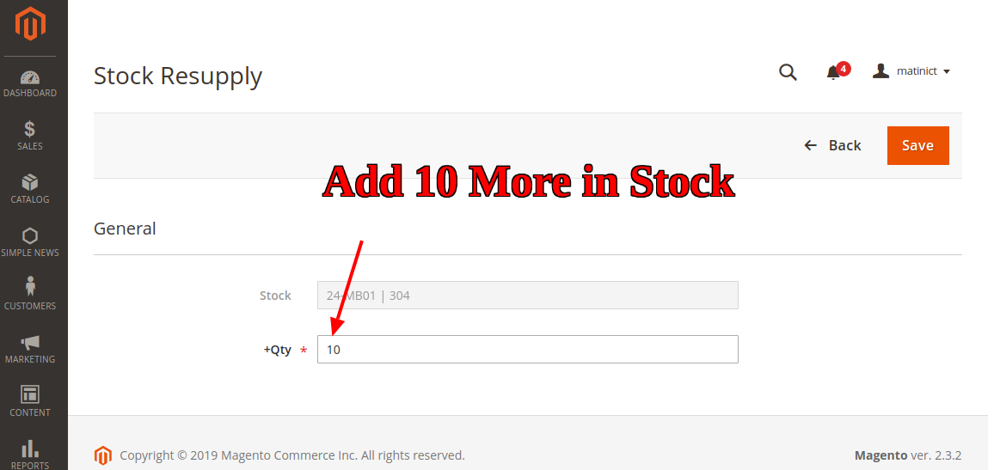
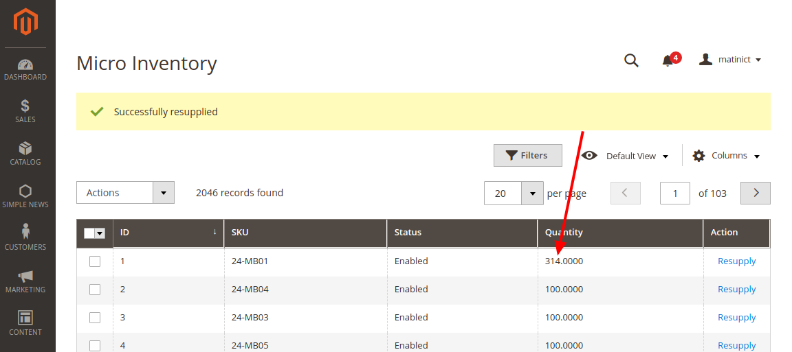
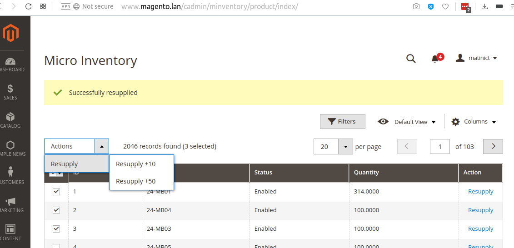

# BDC_Minventory

This module is used as a resupply for stock BDCrops Magento 2 extensions.
Magento 2 Stock / Inventory Management, demonstrating UI grid.

## Goal
- Quick Stock / Inventory update from admin
- Easily bump up product stock in certain increments without ever getting access to other areas of the Magento admin.
- Better understanding of the adminhtml developing for the adminhtml area
- Using the listing  & form component


## How to install & upgrade BDC_Minventory


### 1.1 Copy and paste

If you don't want to install via composer, you can use this way.

- Download [the latest version here](https://github.com/bdcrops/module-minventory/archive/master.zip)
- Extract `master.zip` file to `app/code/BDC/Core` ; You should create a folder path `app/code/BDC/Core` if not exist.
- Go to Magento root folder and run upgrade command line to install `BDC_Minventory`:


### 1.2 Install via composer

We recommend you to install BDC_Minventory module via composer. It is easy to install, update and maintaince.Run the following command in Magento 2 root folder.

```
composer config repositories.module-minventory git
https://github.com/bdcrops/module-minventory.git

composer require bdc/module-minventory:~1.0.0
php bin/magento setup:upgrade
php bin/magento setup:static-content:deploy
```

#### 1.2 Upgrade    

```
composer update bdcrops/module-minventory
php bin/magento setup:upgrade
php bin/magento setup:static-content:deploy
```

Run compile if your store in Product mode:

```
php bin/magento setup:di:compile

```
## Tutorial Module Step By Step (BDCrops)


- create app/code/BDC/Minventory/registration.php
```    
<?php
\Magento\Framework\Component\ComponentRegistrar::register(
    \Magento\Framework\Component\ComponentRegistrar::MODULE,
    'BDC_Minventory',
    __DIR__
);
```
- create a app/code/BDC/Minventory/etc/module.xml
```   
<?xml version="1.0"?>
<config xmlns:xsi="http://www.w3.org/2001/XMLSchema-instance" xsi:noNamespaceSchemaLocation="urn:magento:framework:Module/etc/module.xsd">
    <module name="BDC_Minventory" setup_version="1.0.0"/>
</config>
 ```
 - create a app/code/BDC/Minventory/etc/adminhtml/routes.xml
```  
<?xml version="1.0"?>
<config xmlns:xsi="http://www.w3.org/2001/XMLSchema-instance" xsi:noNamespaceSchemaLocation="urn:magento:framework:App/etc/routes.xsd">
    <router id="admin">
        <route id="minventory" frontName="minventory">
            <module name="BDC_Minventory"/>
        </route>
    </router>
</config>  
```
- create a app/code/BDC/Minventory/Controller/Adminhtml/Product.php
```
<?php
namespace BDC\Minventory\Controller\Adminhtml;
abstract class Product extends \Magento\Backend\App\Action {
    const ADMIN_RESOURCE = 'BDC_Minventory::minventory';
}

```
- create a app/code/BDC/Minventory/Controller/Adminhtml/Product/Index.php
```    
<?php
namespace BDC\Minventory\Controller\Adminhtml\Product;

use \Magento\Framework\Controller\ResultFactory;

class Index extends \BDC\Minventory\Controller\Adminhtml\Product{
    public function execute(){
        $resultPage = $this->resultFactory->create(ResultFactory::TYPE_PAGE);
        $resultPage->getConfig()->getTitle()->prepend((__('Micro Inventory')));
        return $resultPage;
    }
}
```
- create a app/code/BDC/Minventory/Controller/Adminhtml/Product/MassResupply.php
```    
<?php

namespace BDC\Minventory\Controller\Adminhtml\Product;
use \Magento\Framework\Controller\ResultFactory;

class MassResupply extends \BDC\Minventory\Controller\Adminhtml\Product {
    protected $filter;
    protected $collectionFactory;
    protected $resupply;

    public function __construct(
        \Magento\Backend\App\Action\Context $context,
        \Magento\Ui\Component\MassAction\Filter $filter,
        \Magento\Catalog\Model\ResourceModel\Product\CollectionFactory $collectionFactory,
        \BDC\Minventory\Model\Resupply $resupply
    ){
        parent::__construct($context);
        $this->filter = $filter;
        $this->collectionFactory = $collectionFactory;
        $this->resupply = $resupply;
    }

    public function execute(){
        $redirectResult = $this->resultFactory->create(ResultFactory::TYPE_REDIRECT);
        $qty = $this->getRequest()->getParam('qty');
        $collection = $this->filter->getCollection($this->collectionFactory->create());
        $productResupplied = 0;
        foreach ($collection->getItems() as $product) {
            $this->resupply->resupply($product->getId(), $qty);
            $productResupplied++;
        }

        $this->messageManager->addSuccessMessage(__('A total of %1 record(s) have been resupplied.', $productResupplied));
        return $redirectResult->setPath('minventory/product/index');
    }
}

```
- create a app/code/BDC/Minventory/Controller/Adminhtml/Product/Resupply.php
```    
<?php

namespace BDC\Minventory\Controller\Adminhtml\Product;

use \Magento\Framework\Controller\ResultFactory;

class Resupply extends \BDC\Minventory\Controller\Adminhtml\Product{
    protected $stockRegistry;
    protected $productRepository;
    protected $resupply;

    public function __construct(
        \Magento\Backend\App\Action\Context $context,
        \Magento\Catalog\Api\ProductRepositoryInterface $productRepository,
        \Magento\CatalogInventory\Api\StockRegistryInterface $stockRegistry,
        \BDC\Minventory\Model\Resupply $resupply
    ) {
        parent::__construct($context);
        $this->productRepository = $productRepository;
        $this->stockRegistry = $stockRegistry;
        $this->resupply = $resupply;
    }

    public function execute() {
        if ($this->getRequest()->isPost()) {
            $this->resupply->resupply(
                $this->getRequest()->getParam('id'),
                $_POST['minventory_product']['qty']
            );
            $this->messageManager->addSuccessMessage(__('Successfully resupplied'));
            $redirectResult = $this->resultFactory->create(ResultFactory::TYPE_REDIRECT);
            return $redirectResult->setPath('minventory/product/index');
        } else {
            $resultPage = $this->resultFactory->create(ResultFactory::TYPE_PAGE);
            $resultPage->getConfig()->getTitle()->prepend((__('Stock Resupply')));
            return $resultPage;
        }
    }
}

```
- create a app/code/BDC/Minventory/Model/Resupply.php
```    
<?php

namespace BDC\Minventory\Model;

class Resupply{
    protected $productRepository;
    protected $collectionFactory;
    protected $stockRegistry;

    public function __construct(
        \Magento\Catalog\Api\ProductRepositoryInterface $productRepository,
        \Magento\Catalog\Model\ResourceModel\Product\CollectionFactory $collectionFactory,
        \Magento\CatalogInventory\Api\StockRegistryInterface $stockRegistry
    ) {
        $this->productRepository = $productRepository;
        $this->collectionFactory = $collectionFactory;
        $this->stockRegistry = $stockRegistry;
    }

    public function resupply($productId, $qty) {
        $product = $this->productRepository->getById($productId);
        $stockItem = $this->stockRegistry->getStockItemBySku($product->getSku());
        $stockItem->setQty($stockItem->getQty() + $qty);
        $stockItem->setIsInStock((bool)$stockItem->getQty());
        $this->stockRegistry->updateStockItemBySku($product->getSku(), $stockItem);
    }
}

```
- create a app/code/BDC/Minventory/etc/adminhtml/menu.xml
```    
<?xml version="1.0"?>

<config xmlns:xsi="http://www.w3.org/2001/XMLSchema-instance"
        xsi:noNamespaceSchemaLocation="urn:magento:module:Magento_Backend:etc/menu.xsd">
    <menu>
        <add id="BDC_Minventory::minventory" title="Micro Inventory" translate="title"
             module="BDC_Minventory" sortOrder="100" parent="Magento_Catalog::inventory"
             action="minventory/product/index" resource="BDC_Minventory::minventory"/>
    </menu>
</config>

```



- create a app/code/BDC/Minventory/etc/acl.xml
```    
<?xml version="1.0"?>

<config xmlns:xsi="http://www.w3.org/2001/XMLSchema-instance"
        xsi:noNamespaceSchemaLocation="urn:magento:framework:Acl/etc/acl.xsd">
    <acl>
        <resources>
            <resource id="Magento_Backend::admin">
                <resource id="Magento_Catalog::catalog">
                    <resource id="Magento_Catalog::catalog_inventory">
                        <resource id="BDC_Minventory::minventory" title="Micro Inventory" translate="title"
                                  sortOrder="30"/>
                    </resource>
                </resource>
            </resource>
        </resources>
    </acl>
</config>

```


- create a app/code/BDC/Minventory/view/adminhtml/layout/minventory_product_index.xml
```    
<?xml version="1.0"?>
<page xmlns:xsi="http://www.w3.org/2001/XMLSchema-instance" xsi:noNamespaceSchemaLocation="../../../../../../../lib/internal/Magento/Framework/View/Layout/etc/page_configuration.xsd">
    <update handle="styles"/>
    <body>
        <referenceContainer name="content">
            <uiComponent name="minventory_listing"/>
        </referenceContainer>
    </body>
</page>

```
- create a app/code/BDC/Minventory/view/adminhtml/layout/minventory_product_resupply.xml
```
<?xml version="1.0"?>
<page xmlns:xsi="http://www.w3.org/2001/XMLSchema-instance"
      xsi:noNamespaceSchemaLocation="../../../../../../../lib/internal/Magento/Framework/View/Layout/etc/page_configuration.xsd">
    <update handle="styles"/>
    <body>
        <referenceContainer name="content">
            <uiComponent name="minventory_resupply_form"/>
        </referenceContainer>
    </body>
</page>

```
- create a app/code/BDC/Minventory/view/adminhtml/ui_component/minventory_listing.xml
```    
<?xml version="1.0" encoding="UTF-8"?>

<listing xmlns:xsi="http://www.w3.org/2001/XMLSchema-instance" xsi:noNamespaceSchemaLocation="urn:magento:module:Magento_Ui:etc/ui_configuration.xsd">
    <argument name="data" xsi:type="array">
        <item name="js_config" xsi:type="array">
            <item name="provider" xsi:type="string">minventory_listing.minventory_listing_data_source</item>
        </item>
    </argument>
    <settings>
        <spinner>minventory_columns</spinner>
        <deps>
            <dep>minventory_listing.minventory_listing_data_source</dep>
        </deps>
    </settings>
    <dataSource name="minventory_listing_data_source" component="Magento_Ui/js/grid/provider">
        <settings>
            <storageConfig>
                <param name="indexField" xsi:type="string">entity_id</param>
            </storageConfig>
            <updateUrl path="mui/index/render"/>
        </settings>
        <dataProvider class="BDC\Minventory\Ui\DataProvider\Product\ProductDataProvider" name="minventory_listing_data_source">
            <settings>
                <requestFieldName>id</requestFieldName>
                <primaryFieldName>entity_id</primaryFieldName>
            </settings>
        </dataProvider>
    </dataSource>
    <listingToolbar name="listing_top">
        <bookmark name="bookmarks"/>
        <columnsControls name="columns_controls"/>
        <filters name="listing_filters" />
        <filters name="listing_filters">
            <filterSelect name="store_id" provider="${ $.parentName }">
                <settings>
                    <options class="Magento\Store\Ui\Component\Listing\Column\Store\Options"/>
                    <caption translate="true">All Store Views</caption>
                    <label translate="true">Store View</label>
                    <dataScope>store_id</dataScope>
                </settings>
            </filterSelect>
        </filters>
        <massaction name="listing_massaction" component="Magento_Ui/js/grid/tree-massactions">
            <action name="resupply">
                <settings>
                    <type>resupply</type>
                    <label translate="true">Resupply</label>
                    <actions>
                        <action name="0">
                            <type>resupply_10</type>
                            <label translate="true">Resupply +10</label>
                            <url path="minventory/product/massResupply">
                                <param name="qty">10</param>
                            </url>
                        </action>
                        <action name="1">
                            <type>resupply_50</type>
                            <label translate="true">Resupply +50</label>
                            <url path="minventory/product/massResupply">
                                <param name="qty">50</param>
                            </url>
                        </action>
                    </actions>
                </settings>
            </action>
        </massaction>
        <paging name="listing_paging"/>
    </listingToolbar>
    <columns name="minventory_columns" class="Magento\Catalog\Ui\Component\Listing\Columns">
        <settings>
            <childDefaults>
                <param name="fieldAction" xsi:type="array">
                    <item name="provider" xsi:type="string">minventory_listing.minventory_listing.minventory_columns.actions</item>
                    <item name="target" xsi:type="string">applyAction</item>
                    <item name="params" xsi:type="array">
                        <item name="0" xsi:type="string">resupply</item>
                        <item name="1" xsi:type="string">${ $.$data.rowIndex }</item>
                    </item>
                </param>
            </childDefaults>
        </settings>
        <selectionsColumn name="ids" sortOrder="0">
            <settings>
                <indexField>entity_id</indexField>
            </settings>
        </selectionsColumn>
        <column name="entity_id" sortOrder="10">
            <settings>
                <filter>textRange</filter>
                <label translate="true">ID</label>
                <sorting>asc</sorting>
            </settings>
        </column>
        <column name="sku" sortOrder="20">
            <settings>
                <filter>text</filter>
                <label translate="true">SKU</label>
            </settings>
        </column>
        <column name="sku" sortOrder="20">
            <settings>
                <filter>text</filter>
                <label translate="true">SKU</label>
            </settings>
        </column>
        <column name="status" component="Magento_Ui/js/grid/columns/select" sortOrder="30">
            <settings>
                <addField>true</addField>
                <options class="Magento\Catalog\Model\Product\Attribute\Source\Status"/>
                <filter>select</filter>
                <dataType>select</dataType>
                <label translate="true">Status</label>
            </settings>
        </column>
        <column name="qty" sortOrder="40">
            <settings>
                <addField>true</addField>
                <filter>textRange</filter>
                <label translate="true">Quantity</label>
            </settings>
        </column>
        <actionsColumn name="resupply" class="BDC\Minventory\Ui\Component\Listing\Columns\Resupply" sortOrder="50">
            <settings>
                <indexField>entity_id</indexField>
            </settings>
        </actionsColumn>
    </columns>
</listing>

```


- create a app/code/BDC/Minventory/view/adminhtml/ui_component/minventory_resupply_form.xml

```    
<?xml version="1.0" ?>
<form xmlns:xsi="http://www.w3.org/2001/XMLSchema-instance" xsi:noNamespaceSchemaLocation="urn:magento:module:Magento_Ui:etc/ui_configuration.xsd">
    <argument name="data" xsi:type="array">
        <item name="js_config" xsi:type="array">
            <item name="provider" xsi:type="string">minventory_resupply_form.minventory_resupply_form_data_source</item>
            <item name="deps" xsi:type="string">minventory_resupply_form.minventory_resupply_form_data_source</item>
        </item>
        <item name="layout" xsi:type="array">
            <item name="type" xsi:type="string">tabs</item>
        </item>
    </argument>
    <settings>
        <buttons>
            <button name="save" class="BDC\Minventory\Block\Adminhtml\Product\Edit\Button\Save"/>
            <button name="back" class="BDC\Minventory\Block\Adminhtml\Product\Edit\Button\Back"/>
        </buttons>
    </settings>
    <dataSource name="minventory_resupply_form_data_source">
        <argument name="data" xsi:type="array">
            <item name="js_config" xsi:type="array">
                <item name="component" xsi:type="string">Magento_Ui/js/form/provider</item>
            </item>
        </argument>
        <dataProvider class="BDC\Minventory\Ui\DataProvider\Product\Form\ProductDataProvider" name="minventory_resupply_form_data_source">
            <settings>
                <requestFieldName>id</requestFieldName>
                <primaryFieldName>entity_id</primaryFieldName>
            </settings>
        </dataProvider>
    </dataSource>
    <fieldset name="minventory_product">
        <argument name="data" xsi:type="array">
            <item name="config" xsi:type="array">
                <item name="label" xsi:type="string" translate="true">General</item>
            </item>
        </argument>
        <field name="stock">
            <argument name="data" xsi:type="array">
                <item name="config" xsi:type="array">
                    <item name="label" xsi:type="string">Stock</item>
                    <item name="visible" xsi:type="boolean">true</item>
                    <item name="dataType" xsi:type="string">text</item>
                    <item name="formElement" xsi:type="string">input</item>
                    <item name="disabled" xsi:type="string">true</item>
                </item>
            </argument>
        </field>
        <field name="qty">
            <argument name="data" xsi:type="array">
                <item name="config" xsi:type="array">
                    <item name="label" xsi:type="string">+Qty</item>
                    <item name="visible" xsi:type="boolean">true</item>
                    <item name="dataType" xsi:type="string">text</item>
                    <item name="formElement" xsi:type="string">input</item>
                    <item name="focused" xsi:type="string">true</item>
                    <item name="validation" xsi:type="array">
                        <item name="required-entry" xsi:type="boolean">true</item>
                        <item name="validate-zero-or-greater" xsi:type="boolean">true</item>
                    </item>
                </item>
            </argument>
        </field>
    </fieldset>
</form>

```
- create a app/code/BDC/Minventory/Block/Adminhtml/Product/Edit/Button/Back.php
```    
<?php

namespace BDC\Minventory\Block\Adminhtml\Product\Edit\Button;

class Back extends \Magento\Backend\Block\Template implements \Magento\Framework\View\Element\UiComponent\Control\ButtonProviderInterface
{
    public function getButtonData() {
        return [
            'label' => __('Back'),
            'on_click' => sprintf("location.href = '%s';", $this->getBackUrl()),
            'class' => 'back',
            'sort_order' => 10
        ];
    }

    public function getBackUrl() {
        return $this->getUrl('*/*/');
    }
}

```
- create a app/code/BDC/Minventory/Block/Adminhtml/Product/Edit/Button/Save.php
```    
<?php

namespace BDC\Minventory\Block\Adminhtml\Product\Edit\Button;

class Save extends \Magento\Backend\Block\Template implements \Magento\Framework\View\Element\UiComponent\Control\ButtonProviderInterface
{
    public function getButtonData() {
        return [
            'label' => __('Save'),
            'class' => 'save primary',
            'data_attribute' => [
                'mage-init' => ['button' => ['event' => 'save']],
                'form-role' => 'save',
            ],
            'sort_order' => 20,
        ];
    }
}

```
- create a app/code/BDC/Minventory/Ui/Component/Listing/Columns/Resupply.php
```    
<?php

namespace BDC\Minventory\Ui\Component\Listing\Columns;

class Resupply extends \Magento\Ui\Component\Listing\Columns\Column
{
    protected $urlBuilder;

    public function __construct(
        \Magento\Framework\View\Element\UiComponent\ContextInterface $context,
        \Magento\Framework\View\Element\UiComponentFactory $uiComponentFactory,
        \Magento\Framework\UrlInterface $urlBuilder,
        array $components = [],
        array $data = []
    )
    {
        $this->urlBuilder = $urlBuilder;
        parent::__construct($context, $uiComponentFactory, $components, $data);
    }

    public function prepareDataSource(array $dataSource)
    {
        if (isset($dataSource['data']['items'])) {
            $storeId = $this->context->getFilterParam('store_id');

            foreach ($dataSource['data']['items'] as &$item) {
                $item[$this->getData('name')]['resupply'] = [
                    'href' => $this->urlBuilder->getUrl(
                        'minventory/product/resupply',
                        ['id' => $item['entity_id'], 'store' => $storeId]
                    ),
                    'label' => __('Resupply'),
                    'hidden' => false,
                ];
            }
        }

        return $dataSource;
    }
}

```
- create a app/code/BDC/Minventory/Ui/DataProvider/Product/Form/ProductDataProvider.php
```  
<?php

namespace BDC\Minventory\Ui\DataProvider\Product\Form;

class ProductDataProvider extends \Magento\Ui\DataProvider\AbstractDataProvider
{
    protected $loadedData;
    protected $productRepository;
    protected $stockRegistry;
    protected $request;

    public function __construct(
        string $name,
        string $primaryFieldName,
        string $requestFieldName,
        \Magento\Catalog\Model\ResourceModel\Product\CollectionFactory $collectionFactory,
        \Magento\Catalog\Api\ProductRepositoryInterface $productRepository,
        \Magento\CatalogInventory\Api\StockRegistryInterface $stockRegistry,
        \Magento\Framework\App\RequestInterface $request,
        array $meta = [], array $data = []
    )
    {
        parent::__construct($name, $primaryFieldName, $requestFieldName, $meta, $data);
        $this->collection = $collectionFactory->create();
        $this->productRepository = $productRepository;
        $this->stockRegistry = $stockRegistry;
        $this->request = $request;
    }

    public function getData()
    {
        if (isset($this->loadedData)) {
            return $this->loadedData;
        }

        $id = $this->request->getParam('id');
        $product = $this->productRepository->getById($id);
        $stockItem = $this->stockRegistry->getStockItemBySku($product->getSku());

        $this->loadedData[$product->getId()]['minventory_product'] = [
            'stock' => __('%1 | %2', $product->getSku(), $stockItem->getQty()),
            'qty' => 10
        ];

        return $this->loadedData;
    }
}

```
- create a app/code/BDC/Minventory/Ui/DataProvider/Product/ProductDataProvider.php

```
<?php

namespace BDC\Minventory\Ui\DataProvider\Product;

class ProductDataProvider extends \Magento\Ui\DataProvider\AbstractDataProvider
{
    protected $collection;

    public function __construct(
        string $name,
        string $primaryFieldName,
        string $requestFieldName,
        \Magento\Catalog\Model\ResourceModel\Product\CollectionFactory $collectionFactory,
        array $meta = [],
        array $data = []
    )
    {
        parent::__construct(
            $name,
            $primaryFieldName,
            $requestFieldName,
            $meta,
            $data
        );

        $this->collection = $collectionFactory->create();

        $this->joinQty();
    }

    public function getData()
    {
        if (!$this->getCollection()->isLoaded()) {
            $this->getCollection()->load();
        }

        // By default parent's getData already does $this->getCollection()->toArray();
        // However, this is not enough for product collection as we need the "totalRecords and items" structure
        $items = $this->getCollection()->toArray();

        return [
            'totalRecords' => $this->getCollection()->getSize(),
            'items' => array_values($items),
        ];
    }

    protected function joinQty()
    {
        if ($this->getCollection()) {
            $this->getCollection()->joinField(
                'qty',
                'cataloginventory_stock_item',
                'qty',
                'product_id=entity_id'
            );
        }
    }
}


```

- Output







### Ref
